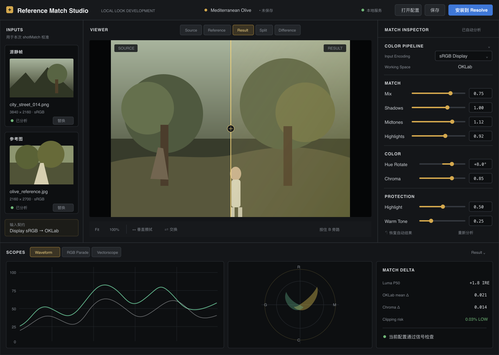

# Reference Match Studio PRD v0.2

**状态：** v0.1.0 首发基线；产品、原型与代码已交付
**评审对象：** 产品命名、配置驱动架构、专业调色工作流、界面原型
**替代关系：** 本文继承 `DCTL_Generator_PRD_v0.1.md` 的算法基线，但重做产品定位、交付模型与界面信息架构
**发布说明：** 本文保留原始设计决策；当前实现、安装方式与限制以根目录 README 和 v0.1.0 Release Notes 为准。

## 1. 变更背景

现有版本已经能完成“参考图 + 源静帧 → 分析 → 预览 → 导出 DCTL”，但存在两个产品级问题：

1. `CityStreet_to_Mediterranean_Olive_V5_Debug.dctl` 把一次具体实验的源场景、目标风格、版本和调试状态写进文件名，不适合作为可发布、可复用的产品能力。
2. 当前 WebUI 借用了 DaVinci Resolve 的视觉符号，但“调色 / LUT 库 / 媒体池 / 54% / 时间码 / 节点”等元素没有对应功能。它们占据空间、制造错误预期，并没有帮助用户完成参考匹配。

本次改版不再“复刻 Resolve 的外观”，而是建立一个能真正嵌入视频工作者思维模型的独立 Look 开发工具。

## 2. 产品定位与命名

### 2.1 建议命名

| 对象 | 建议名称 | 说明 |
| --- | --- | --- |
| 产品 | **Reference Match Studio** | 表达参考匹配与专业工作台，不绑定某一种风格。 |
| 通用 DCTL | **ReferenceMatch.dctl** | 对外稳定名称，不包含场景、风格、版本或 Debug。 |
| 配置文件 | **`<profile-name>.rmatch.json`** | 可读、可版本化、可分享；与普通业务 JSON 区分。 |
| 本地桥接器 | **Reference Match Bridge** | 将选中的 JSON 配置激活为 DCTL 可读取的编译期数据。 |

原 `CityStreet_to_Mediterranean_Olive_V5_Debug.dctl` 在迁移后仅作为历史样例归档。其对应公开配置可命名为 `Mediterranean_Olive.rmatch.json`。

### 2.2 一句话定位

面向调色师与视频创作者的本地参考匹配工作台：把参考图转成可复核、可版本化的 Look 配置，在可靠的画面对比和示波器反馈下完成调整，并安全交付给 DaVinci Resolve。

### 2.3 产品边界

- 它是 Look 开发与技术验证工具，不是视频剪辑器，也不模拟完整 Resolve。
- 它给出可继续精修的起点，不替代镜头平衡、二级调色、肤色判断和最终 QC。
- 所有图像与配置默认只在本机处理。

## 3. 核心架构决策：配置驱动，而非每次生成一套产品代码

### 3.1 用户期望

用户在 WebUI 中完成匹配后，只保存一份 JSON 配置；Resolve 侧使用一个长期稳定、名称通用的 `ReferenceMatch.dctl`，避免每种风格维护一套不同代码。

### 3.2 技术可行性结论

标准 DCTL 是逐像素执行的 GPU 变换。当前可用机制包括编译期常量、UI 参数、相对路径 `#include` 和外部 LUT 声明，但没有通用的运行时文件 I/O 或 JSON 解析接口。因此：

- **不可采用：** `ReferenceMatch.dctl` 在 Resolve 渲染每帧时直接打开并解析任意 `.json`。
- **可以采用：** JSON 作为唯一可编辑的配置源；激活时由本地桥接器校验 JSON，并生成 DCTL 可编译的 `ReferenceMatchProfile.h`。稳定的 `ReferenceMatch.dctl` 通过 `#include` 使用该配置。
- **未来可采用：** OFX 或 Resolve 工作流插件在宿主层读取 JSON、管理配置选择和刷新；这不属于纯 DCTL 能力。

### 3.3 v0.2 推荐交付链路

```text
Reference Match Studio
  └─ 保存 Mediterranean_Olive.rmatch.json       唯一可编辑配置源
                ↓ 校验 schema / engine 版本 / 数值范围
Reference Match Bridge
  └─ 生成 ReferenceMatchProfile.h               机器生成，不供手改
                ↓ #include
ReferenceMatch.dctl                              稳定通用引擎
                ↓ Resolve 刷新 DCTL
DaVinci Resolve DCTL 节点
```

对用户暴露两个明确动作：

- **保存配置**：只产生 `.rmatch.json`，便于归档、Git 管理和分享。
- **安装到 Resolve**：调用本地桥接器激活当前配置并提示刷新。它不是另一种“导出 DCTL”。

### 3.4 为什么不建议让 WebUI 每次导出完整 DCTL

- 算法代码和风格数据被混在同一个文件中，难以升级引擎而保留配置。
- 文件名随风格膨胀，用户无法判断多个 DCTL 的算法版本是否一致。
- 不利于配置 diff、兼容性校验和批量迁移。

### 3.5 Profile 类型与泛化边界

当前算法把“源图统计量”和“参考图统计量”同时固化。它本质上是**源场景族到目标风格的配对映射**；只改成通用文件名并不会自动适配所有镜头。

v0.2 明确两种 Profile 语义：

| 类型 | v0.2 支持 | 含义 |
| --- | --- | --- |
| `shotMatch` | 是 | 包含源静帧与参考图统计，适用于同机位、同光线或相似场景的一组镜头。 |
| `styleOnly` | 否，预留 schema | 只描述目标 Look；对每个新镜头仍需重新分析/平衡后再匹配。需要新的算法与 Resolve 集成。 |

界面不得宣传“任意场景通用”。配置必须显示适用输入色彩空间、代表性源素材和场景标签；素材明显偏离时给出“建议重新校准”的非阻断提示。

## 4. JSON 配置规范

### 4.1 设计原则

- JSON 是人可读、可 diff 的源事实；派生的 Header/DCTL 不允许反向编辑。
- schema 与 engine 独立版本化，未知主版本必须拒绝激活。
- 不默认写入用户的绝对文件路径；使用素材显示名、可选哈希与统计摘要。
- 数值单位、范围、输入/输出色彩契约必须自描述。

### 4.2 v0.2 示例

```json
{
  "schemaVersion": "1.0",
  "profile": {
    "id": "mediterranean-olive-01",
    "name": "Mediterranean Olive",
    "type": "shotMatch",
    "createdAt": "2026-08-24T20:30:00Z",
    "tags": ["exterior", "daylight", "olive", "warm-highlight"]
  },
  "engine": {
    "id": "reference-match",
    "minVersion": "0.2.0"
  },
  "colorPipeline": {
    "inputEncoding": "srgb-display",
    "workingPrimaries": "rec709-srgb",
    "transferSpace": "oklab",
    "outputEncoding": "same-as-input"
  },
  "calibration": {
    "source": {
      "label": "City Street Representative",
      "mean": [0.0, 0.0, 0.0],
      "std": [1.0, 1.0, 1.0]
    },
    "reference": {
      "label": "Mediterranean Olive Reference",
      "mean": [0.0, 0.0, 0.0],
      "std": [1.0, 1.0, 1.0]
    }
  },
  "controls": {
    "mix": 0.75,
    "shadows": 1.0,
    "midtones": 1.0,
    "highlights": 1.0,
    "highlightProtect": 0.5,
    "warmToneProtect": 0.25,
    "hueRotateDegrees": 8.0,
    "chromaScale": 0.85
  },
  "validation": {
    "previewTransformHash": "sha256:...",
    "warnings": []
  }
}
```

实际 schema 中必须为数组长度、浮点范围、枚举和必填字段定义严格校验；示例中的统计数字仅为结构占位，不代表实际 Look。

## 5. 专业用户工作流

### 5.1 主任务流

```text
新建/打开配置
      ↓
定义色彩管线
      ↓
导入源静帧与参考图
      ↓
分析并生成初始匹配
      ↓
在 Result / Source / Reference / Split / Difference 中评估
      ↓
结合 Waveform / RGB Parade / Vectorscope 调整
      ↓
通过兼容性与信号检查
      ↓
保存 .rmatch.json
      ↓
安装到 Resolve
```

### 5.2 为什么采用这个顺序

- 先确认色彩管线，避免把 Log、场景线性和 display-referred 静帧混在一起比较。
- 画面与示波器同时反馈，避免只追求直方图相似而破坏肤色、高光或黑位。
- “保存配置”与“安装到 Resolve”分离，让创作结果可追溯，宿主集成可失败重试。

行业产品也普遍围绕这些真实任务组织界面：DaVinci Resolve 强调节点、Gallery/Still 复用、色彩管理和示波器；Premiere 的 Color 工作区把画面、颜色控制和 scopes 放在同一任务空间，并用 Comparison View 支持参考帧/当前帧比较；Final Cut Pro 允许比较查看器与最多四个 scopes 联合显示。参考来源：[DaVinci Resolve Color](https://www.blackmagicdesign.com/uk/products/davinciresolve/color)、[Premiere Color Workspace](https://helpx.adobe.com/uk/premiere/desktop/correct-color/color-correction-fundamentals/about-color-grading.html)、[Premiere Comparison View](https://helpx.adobe.com/premiere/desktop/correct-color/color-mode-fundamentals/about-comparison-view.html)、[Final Cut Pro Video Scopes](https://support.apple.com/en-gb/guide/final-cut-pro/ver761cad58/mac)。

Colourlab AI 的参考匹配工作流同样把“选择参考 → 匹配 → 回到宿主继续调色”作为主线，并强调本地处理与专业色彩管理；本产品借鉴其任务简化思路，但不宣称具备其 AI 或 ACES 能力。参考：[Colourlab AI workflow](https://colourlab.ai/colourlab-ai-for-premiere-fcp/)。

## 6. 界面信息架构

### 6.1 设计原则

1. **画面优先。** 主监看区占据最大面积，参数面板不抢占画面判断空间。
2. **任务优先于软件仿制。** 不出现本产品没有的“媒体池、时间线、节点树、LUT 库”。
3. **可见即有用。** 每个按钮、标签页、数值、状态都必须可操作、可解释或反映真实状态。
4. **主观判断与客观测量并列。** 监看器负责观感，Scopes 与 Match Delta 负责验证。
5. **渐进披露。** 默认只显示完成当前步骤需要的控制；技术细节进入折叠区。
6. **状态可信。** 未加载、分析中、未保存、配置不兼容、安装成功/失败必须有明确反馈。
7. **不伪造宿主状态。** 没有真实视频就不显示时间码；没有时间线就不显示播放控制；没有节点编辑就不画节点。

### 6.2 桌面端主界面

```text
┌──────────────────────────────────────────────────────────────────────────────┐
│ Reference Match Studio │ Mediterranean Olive • 未保存 │ 打开 │ 保存 │ 安装到Resolve │
├──────────────┬──────────────────────────────────────────┬────────────────────┤
│ INPUTS       │ VIEWER                                   │ MATCH INSPECTOR    │
│              │ [Source] [Reference] [Result] [Split]    │ 色彩管线           │
│ 源静帧       │                                          │ 匹配强度           │
│ [缩略图/导入]│              主监看画面                  │ 亮度分区           │
│              │                                          │ 色彩与保护         │
│ 参考图       │ [Fit] [100%] [水平/垂直擦拭] [按住旁路] │ 恢复 / 重新分析    │
│ [缩略图/导入]│                                          │                    │
├──────────────┴──────────────────────────────┬───────────┴────────────────────┤
│ SCOPES: Waveform | RGB Parade | Vectorscope │ MATCH DELTA / WARNINGS          │
│ 实际示波器画面，可切换单/双联布局            │ 亮度、色度、色相、越界风险        │
└─────────────────────────────────────────────┴────────────────────────────────┘
```

### 6.3 顶部应用栏

只保留全局真实动作：

- 产品名与本地处理状态。
- 当前 Profile 名、`已保存/未保存` 状态。
- `新建`、`打开配置`、`保存配置`、`安装到 Resolve`。
- 安装按钮旁显示 Bridge/Resolve 兼容状态；不可用时给出原因和修复入口。

删除现有“调色 / LUT 库 / 媒体池 / 54% / 00:00:00:00 / 节点 / DCTL”装饰栏。若未来某项真的实现，再按任务需要加入。

### 6.4 输入区

- 源静帧、参考图是两个有语义的素材槽，不伪装成 Resolve 节点。
- 空状态显示支持格式、色彩解释与明确的导入动作，不渲染空 ``。
- 导入后显示缩略图、文件名、尺寸、推断编码、替换/移除动作。
- 支持拖放；拖入时高亮准确的目标槽。

### 6.5 主监看器

必须提供以下真实模式：

| 模式 | 用途 |
| --- | --- |
| Source | 检查输入与曝光基础。 |
| Reference | 独立观察目标画面。 |
| Result | 观察匹配结果。 |
| Split | Source/Result 或 Reference/Result 的水平、垂直可拖动擦拭。 |
| Difference | 显示可解释的差异图，并明确它不是审美评分。 |

监看工具：Fit、100%、缩放值、全屏、水平/垂直分割、交换左右、按住旁路。没有视频输入时不显示播放、音量、时间码。

### 6.6 Match Inspector

按工作顺序分组，而不是堆满滑块：

1. **Color Pipeline**：输入编码、工作原色、输出约定；变更后要求重新分析。
2. **Match**：Mix、Shadows、Midtones、Highlights。
3. **Color**：Hue Rotate、Chroma。
4. **Protection**：Highlight Protect、Warm Tone Protect；明确暖色保护不是肤色检测。
5. **Actions**：重新分析、恢复自动结果、恢复 Profile 默认值。

每个参数都必须支持滑杆、精确数值输入、双击复位，并在修改后标记 Profile 为未保存。参数更新采用短防抖实时预览；高分辨率处理时允许切换为“手动更新”。

### 6.7 Scopes 与验证区

v0.2 只显示真实计算结果：

- Waveform Luma。
- RGB Parade。
- Vectorscope YUV/CbCr，含肤色线仅作为方向参考。
- 单示波器、双示波器与隐藏三种布局。
- Scopes 默认分析当前 Result；可切换 Source/Reference。
- Match Delta 显示亮度分位差、OKLab 均值差、色度差和潜在 clipping 比例。
- 不把单一“匹配分数”包装成质量结论；数值旁解释其测量对象。

### 6.8 空状态

首次进入只呈现：产品价值说明、两个导入槽、色彩管线默认值和“打开已有配置”。监看器与 scopes 使用设计好的空面板，不创建无 `src` 的图片元素，不显示 alt 文本或破图图标。

## 7. 关键交互与快捷键

| 动作 | 鼠标/按钮 | 快捷键建议 |
| --- | --- | --- |
| Source / Reference / Result | Viewer 模式切换 | `1` / `2` / `3` |
| Split 对比 | Viewer 工具 | `4` |
| 按住旁路 | Viewer 工具 | 按住 `B` |
| Fit / 100% | Viewer 缩放 | `F` / `Z` |
| 保存配置 | 顶部主动作 | `Cmd/Ctrl + S` |
| 重新分析 | Inspector 动作 | `Cmd/Ctrl + R`，避免覆盖浏览器刷新时需拦截说明 |
| 全屏监看 | Viewer 工具 | `Shift + F` |

所有快捷键必须同时有可发现的按钮或菜单；输入框获得焦点时不得误触。

## 8. 错误与状态设计

| 状态 | 界面反馈 |
| --- | --- |
| 仅导入一侧素材 | 明确提示还需另一侧，不显示可用的“分析”按钮。 |
| 编码不明确 | 在素材槽和 Color Pipeline 同时显示待确认，不静默猜测。 |
| Profile schema 不兼容 | 阻止激活，保留只读查看，并指出支持版本。 |
| Bridge 未安装/不可达 | “安装到 Resolve”禁用，提供本地安装说明；保存 JSON 仍可用。 |
| Resolve 未刷新 | 安装完成后显示具体刷新步骤，不把“文件已写入”表述为“Resolve 已生效”。 |
| 参数越界/JSON 被手改 | 指出字段路径、期望范围和实际值。 |
| 当前素材偏离校准范围 | 非阻断警告“建议重新校准”，允许继续预览。 |

## 9. MVP 功能范围

### 9.1 v0.2 必须实现（评审通过后）

- 通用命名和 `.rmatch.json` schema。
- 新建、打开、保存、另存 Profile。
- 双静帧导入、分析、实时/手动预览。
- 五种 Viewer 模式和实际缩放/擦拭控制。
- Waveform、RGB Parade、Vectorscope 与 Match Delta。
- 分组 Inspector、数值输入、复位和未保存状态。
- Bridge 激活流程、版本校验、生成 Header、Resolve 刷新说明。
- 空状态、错误状态、键盘可用性和 1440px/1920px 桌面适配。

### 9.2 后续版本

- 直接读取视频/时间线、帧选择与播放控制。
- 多镜头 Clip Grid、参考帧收藏、场景组批量匹配。
- `styleOnly` 跨场景 Profile。
- DWG/Intermediate、ACEScct、LogC、S-Log3、DPX/EXR/RAW 完整色彩管线。
- Resolve 工作流插件或 OFX：宿主内选 Profile、热更新和节点自动化。
- `.cube`、预览图、Look 包和团队 Profile 库。

在这些功能真正实现之前，界面不得提前展示相应入口。

## 10. 非功能需求

- **本地优先：** 图片、统计量和 Profile 默认不上传网络。
- **确定性：** 相同 engine 版本、输入与 JSON 必须产生相同预览和 DCTL 结果。
- **可追溯：** Profile 记录 schema、最低 engine 版本、色彩管线和预览变换哈希。
- **响应性：** 1440px 宽桌面端保持 Viewer 为最大区域；Inspector 最小 320px、最大 420px。
- **可访问性：** 文字/背景至少 WCAG AA；不能只靠红绿传达状态；全键盘可达并有清晰焦点。
- **性能目标：** 2K 静帧参数预览 P95 小于 300ms；首次完整分析 P95 小于 2s（目标机器待定义）。

## 11. 验收标准

1. 首次打开无破图、无空 alt、无假时间码、无不可点击的导航或工具按钮。
2. 用户无需阅读说明即可完成“导入 → 分析 → 对比 → 调整 → 保存配置”。
3. 每个可见控件都能触发对应动作、切换真实内容或呈现真实状态；占位功能不得进入生产界面。
4. Source/Reference/Result/Split/Difference 与 Scopes 分析对象保持同步并有明确标识。
5. 修改任意参数后出现未保存状态；保存并重新打开 JSON 后结果一致。
6. 非法或不兼容 JSON 不得生成 Header，错误定位到具体字段。
7. Bridge 激活后，`ReferenceMatch.dctl` 使用的配置与 JSON 哈希一致；不宣称 DCTL 运行时读取 JSON。
8. Web 预览与 Resolve 中 DCTL 的标准色卡输出在约定误差内一致；阈值在实现阶段通过验证样本确定。
9. 1440×900 与 1920×1080 下 Viewer 均为视觉主体，核心操作无需横向滚动。
10. UI 不使用 DaVinci Resolve 的商标、品牌图标或无功能的界面复制。

## 12. 原型评审范围

本轮提供三种独立高保真方向，均遵循上述功能边界：

1. **Viewer-led Grading Desk**：最大化单一监看器，输入在左、参数在右、Scopes 在下；适合精细单 Look 开发。
2. **Compare-first Match Lab**：Source / Reference / Result 对比是中心，调节与差异验证紧邻画面；适合快速匹配决策。
3. **Profile Workflow Console**：突出 Profile 状态、校准、验证与 Resolve 安装步骤；适合配置管理和工程交付。

### 方案 1：Viewer-led Grading Desk



### 方案 2：Compare-first Match Lab


### 方案 3：Profile Workflow Console


可编辑的矢量源稿与 PNG 同目录保存，便于评审后继续调整布局与标注。

评审只选择信息架构与视觉方向，不代表批准代码实施。

## 13. 评审待决策

1. 产品名与文件名是否采用 `Reference Match Studio` / `ReferenceMatch.dctl` / `.rmatch.json`？
2. v0.2 是否接受“JSON 为唯一配置源 + Bridge 编译期激活”，而不是技术上不可行的 DCTL 运行时直读 JSON？
3. 首版主用户优先级是“单 Look 精细开发”还是“多配置工程管理”？这决定 Viewer 与 Profile 区域的空间权重。
4. 首版是否只承诺 `shotMatch`，并把跨场景 `styleOnly` 明确延后？
5. 三套原型中选择哪一套继续细化？
